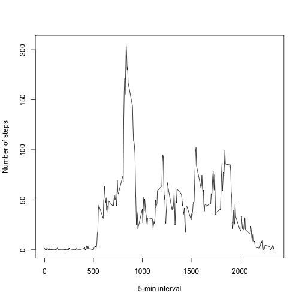

Set the work directory, load the libraries, and read the data file

```r
setwd("/Users/lab/desktop/Coursera/Reproducible Research")

library(plyr)
library(lattice) 

db <-read.csv("activity.csv", header = TRUE)
```

Preprocess the data: format the date variable

```r
db$date1 = as.Date(db$date, format = "%Y-%m-%d")
```

Calculate the total number of steps taken per day

```r
db.sum = ddply(db, .(date), summarize,  steps=sum(steps, na.rm = TRUE))
```

Make a histogram of the total number of steps taken each day

```r
hist(db.sum$steps, main = "Total number of steps per day", xlab = "Steps per day", breaks = 20)
```

 

Calculate and report the mean and median of the total number of steps taken per day

```r
cat("Total number of steps taken per day, mean= " , mean(db.sum$steps, na.rm = TRUE))
```

```
## Total number of steps taken per day, mean=  9354.23
```

```r
cat("Total number of steps taken per day, median = " , median(db.sum$steps, na.rm = TRUE))
```

```
## Total number of steps taken per day, median =  10395
```

Make a time series plot of the 5-minute interval and the average number of steps taken, averaged across all days 

```r
db.5 = ddply(db, .(interval), summarize,  steps=mean(steps, na.rm = TRUE))
plot(x = db.5$interval, y = db.5$steps, type = "l", xlab = "5-min interval", ylab = "Number of steps") 
```

 

Which 5-minute interval, on average across all the days in the dataset, contains the maximum number of steps?


```r
print ("5-minute interval that, on average, contains the maximum number of steps:")
```

```
## [1] "5-minute interval that, on average, contains the maximum number of steps:"
```

```r
db.5[db.5$steps == max(db.5$steps), ]
```

```
##     interval    steps
## 104      835 206.1698
```

Calculate and report the total number of missing values in the dataset (i.e. the total number of rows with 𝙽𝙰s)

```r
missing = is.na(db$steps)
n.missing <- sum(missing)
cat("Number of missing values in the dataset " , n.missing)
```

```
## Number of missing values in the dataset  2304
```

Fill in all of the missing values in the dataset:
Missing values are imputed as the mean of the specific 5-min interval.
Create a new dataset that is equal to the original dataset but with the missing data filled in.

```r
db.imp = db

impute.mean <- function(x) replace(x, is.na(x), mean(x, na.rm = TRUE))
db.imp = ddply(db.imp, ~ interval, transform, steps = impute.mean(steps))
```

Make a histogram of the total number of steps taken each day and Calculate and report the mean and median total number of steps taken per day. 
The mean and median of imputed data are different (larger) than those calculated using the raw data.  

```r
db.sum.imp = ddply(db.imp, .(date), summarize,  steps=sum(steps, na.rm = TRUE))
hist(db.sum.imp$steps, main = "Total number of steps per day", xlab = "Steps per day", breaks = 20)
```

 

```r
cat("Total number of steps taken per day, mean = " , mean(db.sum.imp$steps, na.rm = TRUE))
```

```
## Total number of steps taken per day, mean =  10766.19
```

```r
cat("Total number of steps taken per day, median = " , median(db.sum.imp$steps, na.rm = TRUE))
```

```
## Total number of steps taken per day, median =  10766.19
```

Create a new factor variable in the dataset with two levels – “weekday” and “weekend” indicating whether a given date is a weekday or weekend day.

```r
db.imp$wkday = as.factor(ifelse(weekdays(db.imp$date1) %in% c("Saturday", "Sunday"), "Weekend", "Weekday"))
```

Make a panel plot containing a time series plot (i.e. 𝚝𝚢𝚙𝚎 = "𝚕") of the 5-minute interval (x-axis) and the average number of steps taken, averaged across all weekday days or weekend days (y-axis). 

```r
db.sum.imp1 = ddply(db.imp, c("interval", "wkday"), summarize,  steps=sum(steps, na.rm = TRUE))
xyplot(steps~interval|wkday, data = db.sum.imp1,
            main="",
            ylab="Number of steps", type = "l")
```

 


